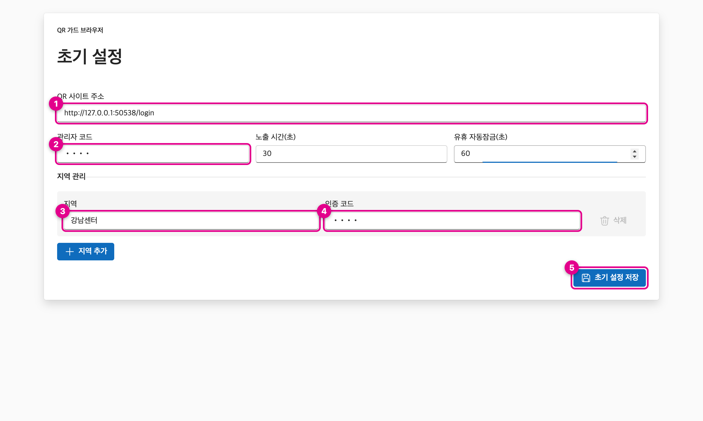
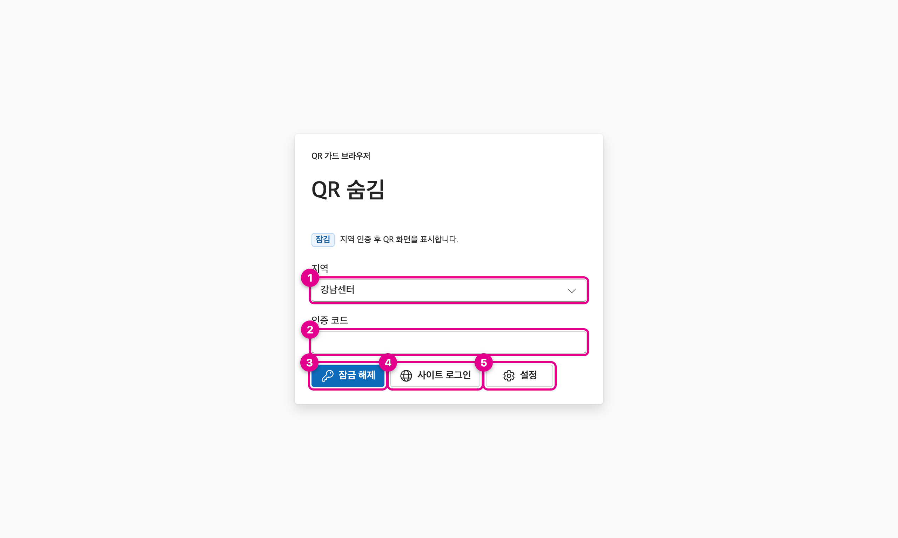
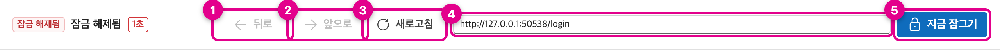
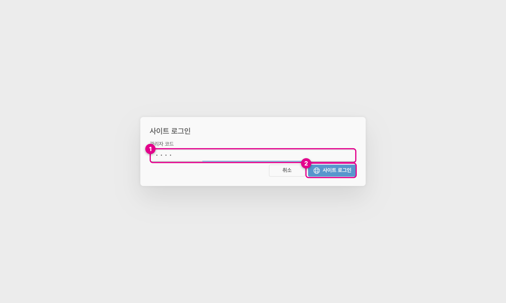
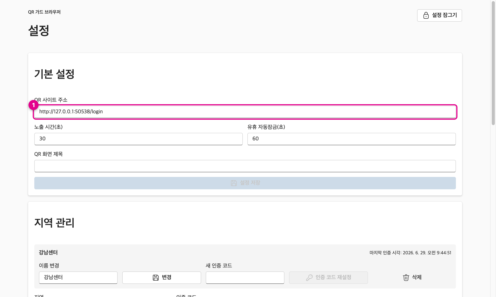

# QR Guard Browser

QR 코드 사이트를 **로컬 잠금 뒤에 숨겨** 주는 데스크톱 브라우저입니다.

QR 화면을 그냥 띄워 두면 지나가는 누구나 찍어 갈 수 있습니다. 이 앱은 지정한 사이트를 실제 Chromium 화면으로 띄우되, **인증한 사람이 정해 둔 시간 동안만** QR을 보여 주고, 시간이 지나거나 자리를 비우거나 QR 화면이 감지되면 **자동으로 다시 가립니다.** 그래서 "권한 있는 사람이, 필요한 순간에만, 잠깐" QR을 노출하도록 통제할 수 있습니다. (macOS · Windows)

---

## 📥 다운로드

> 저장소가 공개되어 있어 **GitHub 로그인 없이** 바로 받을 수 있습니다.

- **항상 최신본**: <https://github.com/Ducaster/qr-guard-browser/releases/latest>
- **Windows**: [`QRGuardBrowserSetup.exe`](https://github.com/Ducaster/qr-guard-browser/releases/latest/download/QRGuardBrowserSetup.exe)
- **macOS**: [`QR Guard Browser.dmg`](https://github.com/Ducaster/qr-guard-browser/releases/latest/download/QR.Guard.Browser.dmg)

---

## 💿 설치

> ⚠️ 코드 서명이 되어 있지 않아 **첫 실행 때만** OS 보안 경고가 뜹니다. 서명되지 않은 앱이라 OS가 한 번 확인을 받는 것이며, 아래 절차대로 한 번만 허용하면 이후로는 바로 열립니다.

### Windows
1. `QRGuardBrowserSetup.exe`를 받아 **더블클릭**합니다.
2. **"Windows의 PC를 보호했습니다"** 파란 창이 뜨면 → **`추가 정보`** 클릭 → **`실행`** 클릭.
3. 별도의 설치 마법사 없이 **자동으로 설치된 뒤 바로 앱이 열립니다** (Slack·Discord·VS Code와 같은 방식). 시작 메뉴에 바로가기가 생기고, 제거는 *제어판 → 프로그램 추가/제거*에서 할 수 있습니다.

### macOS
1. `QR Guard Browser.dmg`를 받아 더블클릭으로 열고, **앱 아이콘을 `Applications` 폴더로 드래그**합니다.
2. 첫 실행 시 *"확인되지 않은 개발자"* 경고가 나오면, 앱을 **마우스 우클릭(또는 Control+클릭) → `열기`** → 다시 **`열기`**.
3. 한 번 허용하면 이후에는 더블클릭으로 바로 열립니다.

---

## 🚀 사용 방법

### 1. 첫 실행 설정
처음 켜면 기본 정보를 한 번 설정합니다. 여기서 정한 값이 앱 전체의 동작 기준이 됩니다.



| 항목 | 무엇 | 왜 필요한가 (목적) |
|------|------|--------------------|
| **① QR 사이트 주소** | 띄울 사이트 주소(보통 로그인 페이지) | 앱이 시작할 때 열 페이지. **시작 주소일 뿐**이라 로그인 후 다른 주소로 이동해도 됩니다. |
| **② 관리자 코드** | 운영자용 비밀번호 | **설정 변경**과 **사이트 로그인 모드 진입**을 운영자만 할 수 있게 막는 잠금. 일반 사용자는 이 코드를 몰라야 합니다. |
| **③ 지역** | 부서·지점 등 단위 이름 | 누가(어느 지역이) QR을 열었는지 **구분·기록**하기 위함. 지역마다 다른 인증 코드를 줍니다. |
| **④ 인증 코드** | 그 지역의 잠금 해제 코드 | 해당 지역 사람만 QR을 열 수 있게 함. `지역 추가`로 여러 지역을 각각 다른 코드로 등록할 수 있습니다. |
| **노출 시간(초)** | QR을 보여 줄 시간 | 해제해도 **잠깐만** 보여 주고 자동으로 잠그기 위함. 어깨너머 촬영·방치 노출을 줄입니다. |
| **유휴 자동잠금(초)** | 무동작 시 잠기는 시간 | 자리를 비웠을 때 화면이 열린 채 방치되지 않도록 **자동으로 잠급니다.** |
| **⑤ 초기 설정 저장** | 설정 완료 | 입력을 저장하고 잠금 화면으로 넘어갑니다. |

### 2. 잠금 해제 (QR 보기)
평소에는 잠겨 있고, QR을 보려면 지역 인증을 합니다.



| 항목 | 무엇 | 왜 이렇게 했나 (목적) |
|------|------|----------------------|
| **① 지역** | 등록된 지역 중 선택 | 직접 입력 대신 **드롭다운 선택**이라 오타·미등록 지역 입력으로 막히는 일이 없습니다. |
| **② 인증 코드** | 그 지역의 코드 입력 | 코드가 맞아야만 잠금이 풀립니다. 여러 번 틀리면 잠시 잠깁니다(무차별 시도 방지). |
| **③ 잠금 해제** | QR 노출 | 누르면 *노출 시간* 동안만 QR이 보이고 자동으로 다시 잠깁니다. |
| **④ 사이트 로그인** | 다단계 로그인 모드 | 로그인을 여러 단계 거쳐야 QR이 나오는 사이트용(아래 4번). |
| **⑤ 설정** | 설정 진입 | 관리자 코드를 입력해야 들어갈 수 있습니다. |

### 3. 브라우저 도구 (잠금 해제 중 상단 막대)
QR이 보이는 동안에는 위쪽에 일반 브라우저처럼 도구 막대가 나타납니다. 로그인·탐색이 자유롭도록 일반 브라우저 기능을 갖춰 두었습니다.



| 버튼 | 목적 |
|------|------|
| **① 뒤로 / ② 앞으로** | 이전/다음 페이지로 이동. 로그인 도중 단계를 잘못 넘어갔을 때 되돌아가기 좋습니다. |
| **③ 새로고침** | 페이지를 다시 불러오기. 오류가 났을 때 복구 수단. |
| **④ 주소창** | 현재 주소를 보여 주고, 직접 입력해 다른 페이지로 이동. 만료된 링크일 때 시작 주소로 되돌아가기 좋습니다. |
| **⑤ 지금 잠그기** | 노출 시간이 남아 있어도 **즉시** 잠급니다. 자리를 뜨기 전에 바로 가릴 때. (왼쪽 숫자는 남은 노출 시간 카운트다운) |

> 소셜·OAuth 팝업 로그인, 생체인증(WebAuthn) 등도 동작합니다. 단, 로그인 팝업도 잠금 안쪽에서 열려 **QR이 새어 나오지 않습니다.**

### 4. 사이트 로그인 모드 (다단계 로그인)
어떤 사이트는 *로그인 → 메뉴 이동 → 여러 번 클릭*을 거쳐야 QR이 나옵니다. 이때 매 단계마다 잠겨 버리면 로그인을 끝낼 수 없으므로, **관리자가 직접 로그인 단계를 진행하는 모드**입니다.



| 항목 | 목적 |
|------|------|
| **① 관리자 코드** | 이 모드는 운영자만 쓰도록 관리자 인증을 요구합니다. |
| **② 사이트 로그인** | 인증하면 로그인·탐색을 자유롭게 하다가, **QR 화면(설정의 "QR 화면 제목"과 일치하는 페이지)이 감지되는 순간 자동으로 잠깁니다.** 즉 로그인 과정은 열어 주되, 진짜 QR이 뜨는 순간만 가립니다. |

### 5. 설정
관리자 코드로 진입해 동작을 바꿀 수 있습니다.



| 항목 | 목적 |
|------|------|
| **① QR 사이트 주소** | 시작 주소 변경. |
| **노출 시간 / 유휴 자동잠금** | QR을 보여 주는 시간과 자동 잠금 시간 조정. |
| **QR 화면 제목** | 이 문구가 페이지 제목에 들어가면 QR로 인식해 **자동 잠금**합니다. (막거나 제한하는 용도가 아니라 "언제 가릴지" 알려 주는 신호) — 주소가 매번 바뀌어도 **제목으로** QR 화면을 알아보기 위함입니다. |
| **지역 관리** | 지역 추가·이름 변경·인증 코드 재설정·삭제. 사람이 바뀌거나 코드가 유출됐을 때 관리. |
| **관리자 코드 변경** | 운영자 비밀번호 교체. |
| **저장된 로그인** | QR 사이트 비밀번호 자동저장/자동완성 관리(개별 삭제 가능). |
| **인증 기록(감사 로그)** | 언제·어느 지역이 QR을 열었는지 기록을 열람/CSV·JSONL로 내보내기. |
| **QR 세션 초기화** | 저장된 쿠키·캐시 삭제. 로그인이 꼬이거나 다른 계정으로 바꿀 때. |

---

## 🔒 동작 원리 (요약)
- QR 화면은 **지역/관리자 인증을 통과한 동안에만** 표시되고, 그 외에는 항상 가려집니다. (인증 전 상태에서는 어떤 경우에도 QR이 보이지 않도록 설계)
- 인증 코드와 관리자 코드는 **scrypt 해시 + OS 키체인(safeStorage)**로 봉인되어 저장되며, 평문으로 보관하지 않습니다.
- QR 사이트 비밀번호 자동저장도 OS 키체인으로 암호화됩니다.

## 🛠️ 개발 / 직접 빌드
```bash
npm ci
npm run dev        # 개발 실행
npm test           # 단위 테스트
npm run test:e2e   # E2E (Playwright)
npm run make       # 설치본(.dmg/.exe) 빌드
```

릴리스(`main` 푸시)는 GitHub Actions가 macOS·Windows 양쪽 설치본을 자동 빌드합니다.
